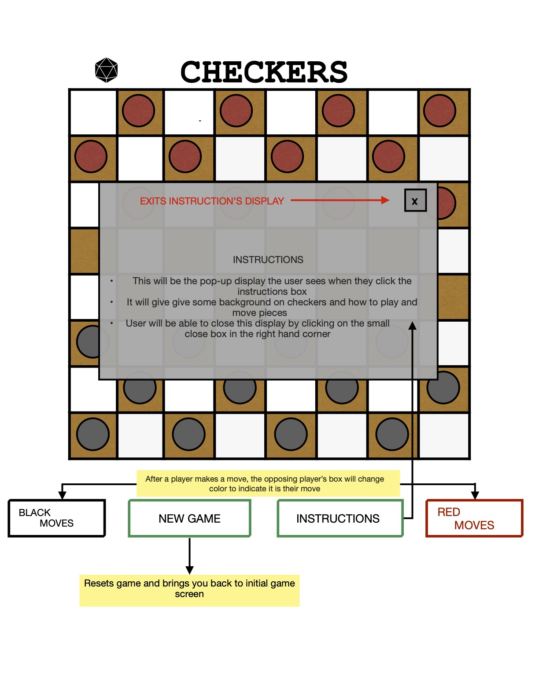
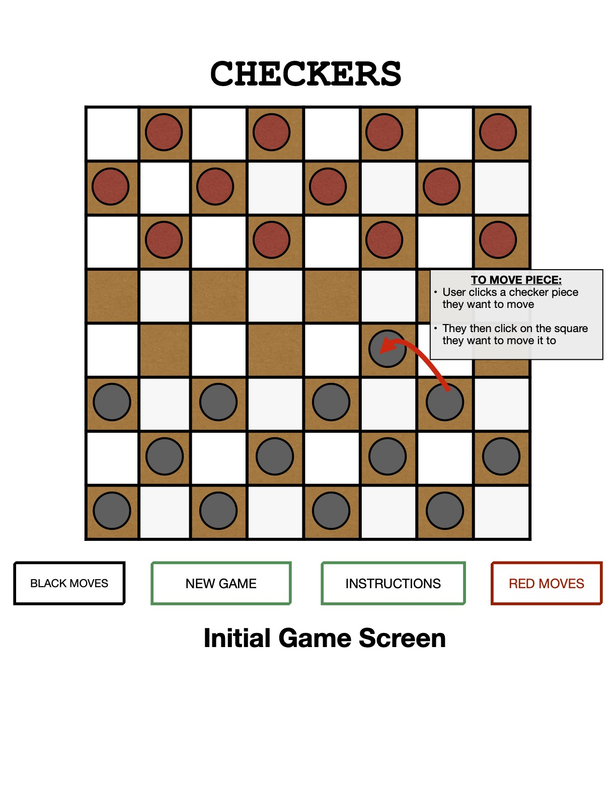
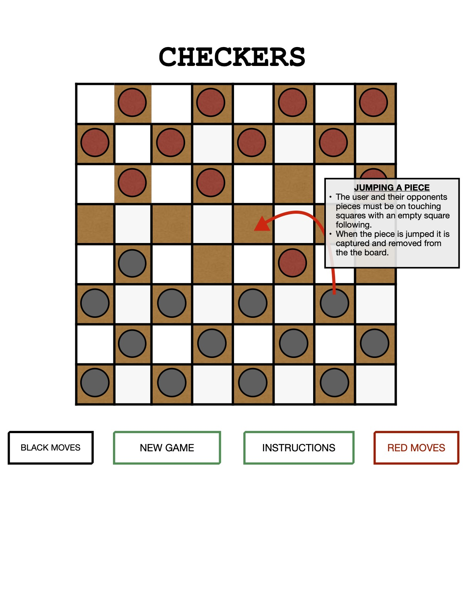

# **UNIT 1 PROJECT:**
## **1.Overview:** ##
I've chosen to build the classic game of checkers as my unit one project. I chose this game because of the learning opportunities it offers and because it is a good stepping stone for eventually building a chess game. I plan to build a chess game as way to learn more about algorithms.

## **2.Game Rules** ##
* User One plays black and User Two plays red
* The goal of the game is for a user to capture all of their opponent's pieces.
* A piece is captured when a user 'jumps' over an opponent's piece
* A piece may only be moved forward and must be moved diagonally onto an immediate color-matching square
* Only one piece may be captured at a time

#### Jumping: ####
* To capture a checker, both user's squares must be touching and contain a checker. 
* An empty square must lie behind the piece to be jumped
* The user moves their piece over the opponent's and jumps onto the empty square.
* The oppenents piece is then removed

## **3.Wireframes** ##
Game Functionality

Moving A Piece

Capturing A Piece

## **4.User Stories** ##
* When the screen loads, the game begins
* Player one is always black and player two always red
* When a player wants to make a move, they click on the piece they wish to move and then click on the square they wish to move their piece to
* After a player tries to move their piece, the program will check whether it is valid or not
* If a move is valid, the DOM will update to show the new position of the piece moved and highlight  ‘black moves’ or ‘red moves’ depending on whose turn it is
* If a move is not valid, audio will play indicating it is not allowed
* Players may only move forwards and onto squares that are the same color as their pieces
* A player may jump over an opponents piece, but only one per move
* Game is over when one player collects all their opponents pieces
* When this point is reached a message will display indicating who won and who lost
* If the ‘new game’ button is clicked, the DOM and all game state variables will refresh
* Before beginning the game, the user may click the ‘instructions’ button
* A display showing details about the game will pop-up when this is clicked

## **Most Viable Product** ##
**Most Viable Product**
1. Create game board
2. Check for valid moves
3. Allow for single jumps
4. Display who won
5. Display instructions
6. Indicate who’s move it is

**Stretch Goals:**
1. Implement ai functionality
2. Add ‘kinging’ feature
3. Implement n jumping greater than one
4. Show user’s collected pieces
5. CSS styling
6. Add 3d board and pieces